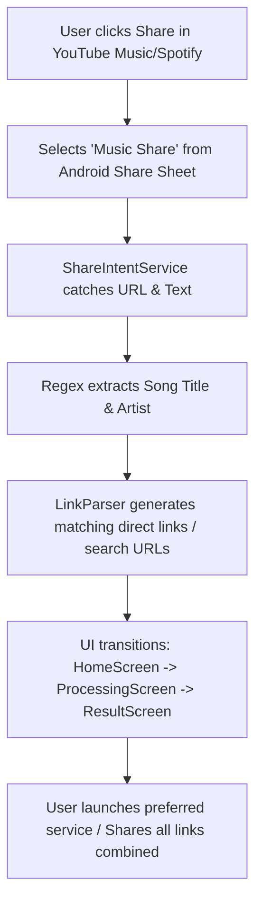

# Music Share 🎵

Music Share is a smart Flutter utility app designed to bridge the gap between music services. When you share a song from one music platform (e.g., YouTube Music, Spotify, Apple Music), Music Share intercepts the link, parses the track details (song name and artist), and dynamically generates sharing links for all other popular music platforms.

No more asking friends, *"Can you send me the Spotify link for this YouTube video?"* – just share it via Music Share!

---

## ✨ Features

- **Seamless Share Intent Integration**: App automatically wakes up or handles shares while running in the background.
- **Intelligent Metadata Extraction**: Uses Regex patterns to parse song titles and artist names from raw share texts (e.g., `"Song Title" by Artist on YouTube Music`).
- **Smart Cross-Platform Link Generation**:
  - Automatically maps shared IDs for matching platforms (such as sharing video IDs between YouTube and YouTube Music).
  - Generates highly accurate search URLs for other platforms (Spotify, Apple Music) using the parsed track title and artist.
- **Minimalist & Clean Stack**: Supports the four major streaming platforms:
  - 🟢 Spotify
  - 🔴 Apple Music
  - 🟥 YouTube Music
  - 📺 YouTube
- **Beautiful UI**: Designed with Material Design components featuring system-integrated Light and Dark modes.

---

## 🛠️ Architecture & Under the Hood

The project utilizes a clean feature-based architecture pattern:

```text
lib/
├── core/
│   ├── constants/
│   │   └── music_services.dart   # Brand colors, matching regex patterns, and URL schemas
│   └── theme/
│       └── app_theme.dart        # Custom light and dark material themes
└── features/
    └── share_handler/
        ├── data/
        │   ├── models/
        │   │   └── music_link.dart     # Models representing structured cross-service links
        │   └── repositories/
        │       └── link_parser.dart    # Pattern recognition for links and search queries
        ├── presentation/
        │   └── screens/
        │       ├── home_screen.dart        # Information landing page
        │       ├── processing_screen.dart  # Visual loader during background metadata analysis
        │       └── result_screen.dart      # Action sheet displaying generated platform links
        └── services/
            └── share_intent_service.dart   # Main controller hook handling Android/iOS intents
```

### Flow Diagram



---

## 🚀 Getting Started

### Prerequisites

- Flutter SDK `^3.11.0`
- Android Studio or VS Code with Flutter extensions installed
- Java Development Kit (JDK) 17 or 21 configured (if building for Android)

### Run Locally

1. Clone or navigate to the repository directory:
   ```bash
   cd music_share
   ```
2. Fetch dependencies:
   ```bash
   flutter pub get
   ```
3. Run the project in debug mode:
   ```bash
   flutter run
   ```

### ⚙️ Android Configuration Notes

- **Android SDK / NDK**: Configured inside `android/app/build.gradle.kts` (targeting SDK 36 and NDK `28.2.13676358`).
- **Gradle JVM Target**: Built using Java 17 toolchain settings. If building on newer systems with JDK 25, ensure `org.gradle.java.home` in [gradle.properties](file:///home/praty/Documents/Projects/music_share/android/gradle.properties) is pointed to a stable JDK 17/21 (e.g., Android Studio's bundled JBR).

---

## 📦 Dependencies

- `provider`: State management pattern.
- `receive_sharing_intent`: Handles incoming shared links/text from other apps.
- `share_plus`: Enables sharing the compiled multi-link message back to messaging apps.
- `url_launcher`: Opens links inside native platform apps or browsers.
